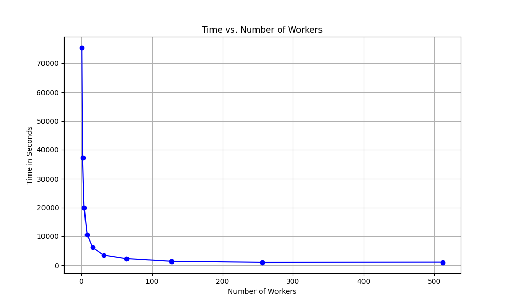

# Indra-HPC

## High-level overview

This is a realistic computational biology pipeline on HPC using the [Indra](http://www.indra.bio/) text mining framework. The parallelisation algorithm employed is simple:
- Phase 1 (local): Launch $n$ workers on $m$ inputs, having each worker handle roughly $\frac{n}{m}$ inputs
- Phase 2 (master): Select a worker (in our case it is always worker 0) to become the master. It shall wait until all workers finish and will summarize their results. 

## Scripts' description

The only script you need to about is `run_pipeline.sh`, which has been described in the next section. 

This script performs some setup work, calls `get_xmls.sh` to create the articles dataset and finally calls `spawn_indra_worker.sh` which is but a wrapper over `indra_worker.py`, the "meat and potatoes" of the whole pipeline. 

Utilities:
- `watch_all.sh` - displays all your workers' outputs as they're created (in real time),
- `watch_one.sh` - like `watch_all.sh` but for one job,
- `watch_queue.sh` - displays how many workers are actively working (in real time),
- `cancel_all.sh` - panic button to kill all your workers (it won't kill your interactive session though),
- `soft_cleanup.sh` - removes temporary files apart from the ones that can take ages to create (the dataset, results and `indra_venv`),
- `hard_cleanup.sh` - runs `soft_cleanup.sh` and removes any leftover datasets, results and `indra_venv`
- `demonstration.sh` - runs the pipeline with different worker counts as separate SLURM jobs. Used for demonstration purposes.

## Running

1. Get the Reach jar available [here](https://owncloud.lcsb.uni.lu/s/WAvPyRYX4B3AfbM/authenticate). Ask us, the project's authors for the password.

2. Type into your shell:
```sh
sbatch run_pipeline.sh <num_articles>
```
This will run the pipeline to process `<num_articles>` articles (defaults to 100,000).

### Additional parameters

- `--ntasks=1`: number of workers. The workers are by default separate SLURM processes distributed among one or possibly more nodes,
- `--cpus-per-task=1` : number of cores for a worker to use during its preassembly phase,
- `--time`: processing one article takes up to 1.5min on average. Adjust this accordingly to be a polite SLURM user.

### Example

The following will execute the pipeline on 50,000 articles with 16 workers, each preassembling with 4 cores:
```sh
sbatch --ntasks=16 --cpus-per-task=4 --time=12:00:00 run_pipeline.sh 50000
```

## Results

The pipeline's results are located in the `results-[num_workers]-workers-[num_articles]-articles` directory, which contains:

- subdirectories of the form`results/worker-[id]` where `[id]` is a worker's id 
- a special subdirectory `results/MASTER` containing a summary of the program's execution:
    - `final_consolidation.json`: combined output of all workers' local processing phases,
    - `local_consolidation_stats.csv`: stats (time taken) for all workers' local processing phase,
    - `final_consolidation_stats.csv`: stats (time taken) for the master's aggregation phase.

### Example

An example output is available in `results/results-4-workers-1000-articles` which as the name suggests contains the results for 4 workers on 1000 articles. Each worker was assigned one CPU core.

## Performance

Since the problem is [embarassingly parallel](https://en.wikipedia.org/wiki/Embarrassingly_parallel), the performance scales extremely well with the number of workers. The following plot is taken for worker counts of $1,2,\ldots, 512$, each worker running on a single core, for a dataset of 1000 entries:



## TODOs

- [ ] Verify that workers' progress is correctly pickled:
    - [ ] `get_statements_from_xmls`
    - [ ] `consolidate_stmts` (local)
    - [ ] `consolidate_stmts` (master)

## Possible refinements
- More fault tolerance mechanisms
    - distributed leader election and dynamic work assignment
    - respawning processes
- Piping jsons to zips with checksum...?
